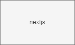

# cose394-docent-chatbot-prototype
COSE394 창의적소프트웨어창업방법론 수업 도슨트 프로젝트 프로토타입을 위한 레포지토리

## Dependency
node=^18.18.0

## 환경 변수 세팅
```
cat <<EOF >> .env
OPENAI_API_KEY=${OPENAI_API_KEY}
EOF
```
## Install
```bash
npm install
```

## Test
```bash
npm run lint
npm run test
```
### E2E
기획파일에 해당되는 파일을 적절한 위치에 옮기고, (\* './script/example_plan.zip' 파일 참고, \* './.data' 추천)
``` bash
bash ./script/build_sql.sh ${FILE_PATH} # example: ./script/example_plan.zip
docker compose up --build
``````

## Architecture

